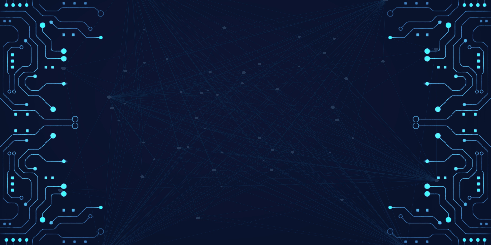
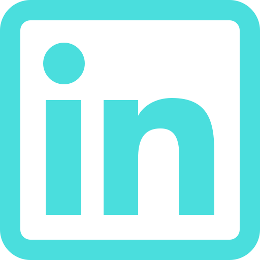
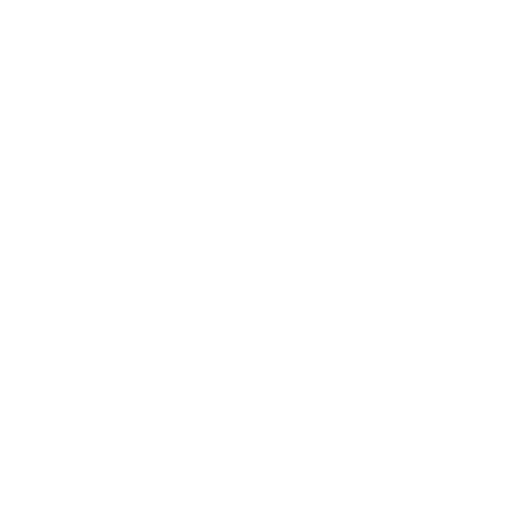

  <!-- Your Banner Image as the Background -->
  
  <!-- Glassmorphism Card on Top with Updated Design -->
  

    
Muhammad Shahin

    <h1 style="margin: 0; font-size: 1.2rem; color: #4ADEDD; text-transform: uppercase; opacity: 0.9; font-weight : 300">Web Developer</h1>
    <!-- Contact Icons -->
    

      <!-- Replace these with actual contact icons or images -->
    

    
    <a href="https://www.linkedin.com/in/shahin-muhammad/" style="color: #fff; text-decoration: none;">LinkedIn</a>
    

    

    
    <a href="https://www.facebook.com/ShahinMuhammad2/" style="color: #fff; text-decoration: none;">Facebook</a>
    

    

    
    <a href="mailto:muhammadshahin002@gmail.com" style="color: #fff; text-decoration: none;">Email</a>
    

    

    <!-- Favorite Technology Logo (Replace with your own SVG image or icon) -->
    

      <!-- Replace this with your favorite technology logo -->
      
      
    

  

# 📊 My Vision?

I am a passionate web developer with an insatiable love for learning new technologies. My mission is to create applications that positively impact people's lives by addressing real-world challenges. Aspiring to carve a meaningful career in software engineering, I am dedicated to continuous growth and innovation. Join me on this journey of exploration, where every line of code contributes to a brighter, more connected future.

# 🖳 What do I do?

I am a `frontend developer` with hands-on experience in technologies such as React, Tailwind CSS, and the MERN stack (MongoDB, Express.js, React, Node.js). My current work involves crafting responsive and dynamic user interfaces. Concurrently, I am expanding my skill set by delving into Object-Oriented Programming (OOP) using PHP, aiming to enhance my backend development capabilities. My journey is a fusion of creative front-end design and continuous learning in the realm of backend technologies.
